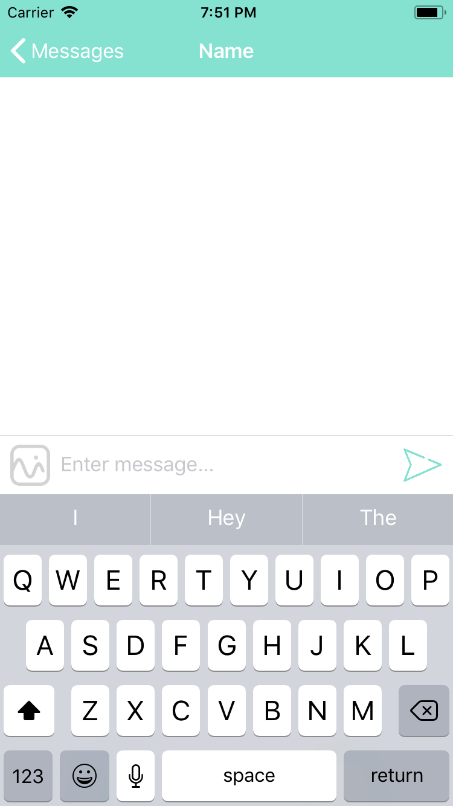
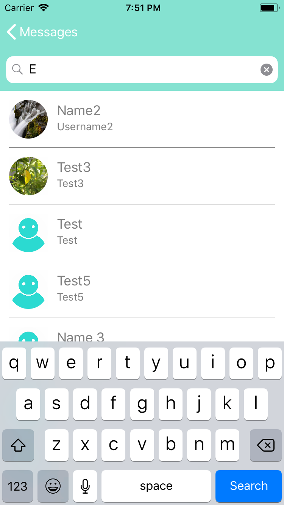
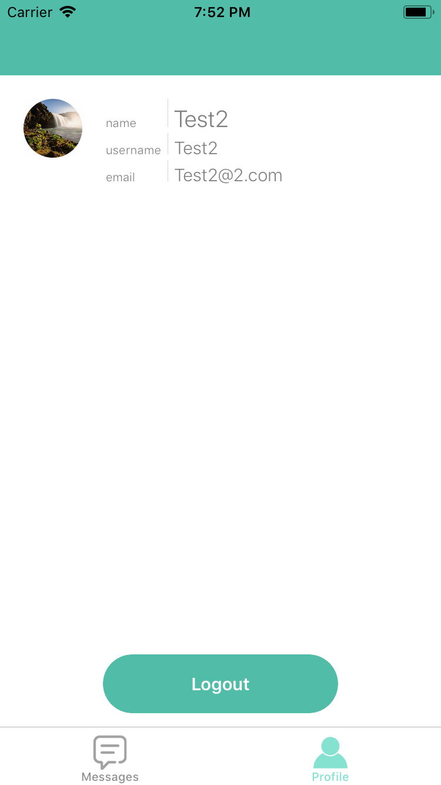

# Summer
### Messaging App
Winter Break Project
 - Google Firebase Database/Storage/Auth

### Screenshots
##### Login/Register/Messages/Chat/Users/Profile Pages:
       
 
##### Sending Texts/Photos/Drawings:
     

##### Updated UI for Messages/Users Lists:
   
