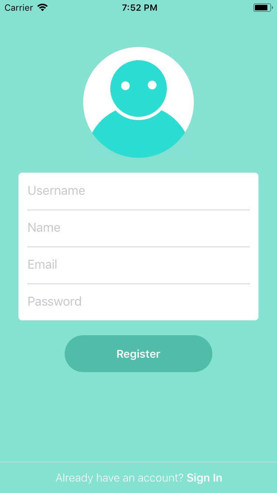
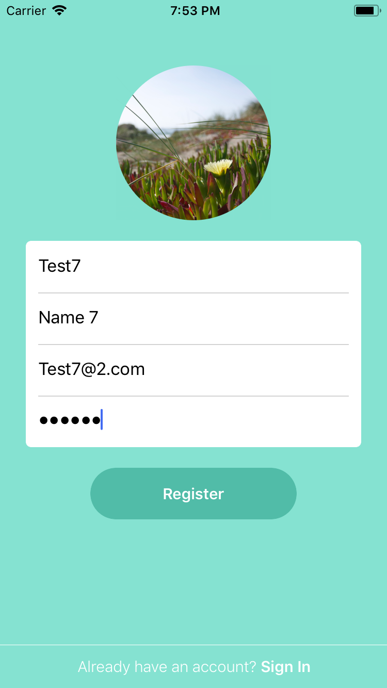
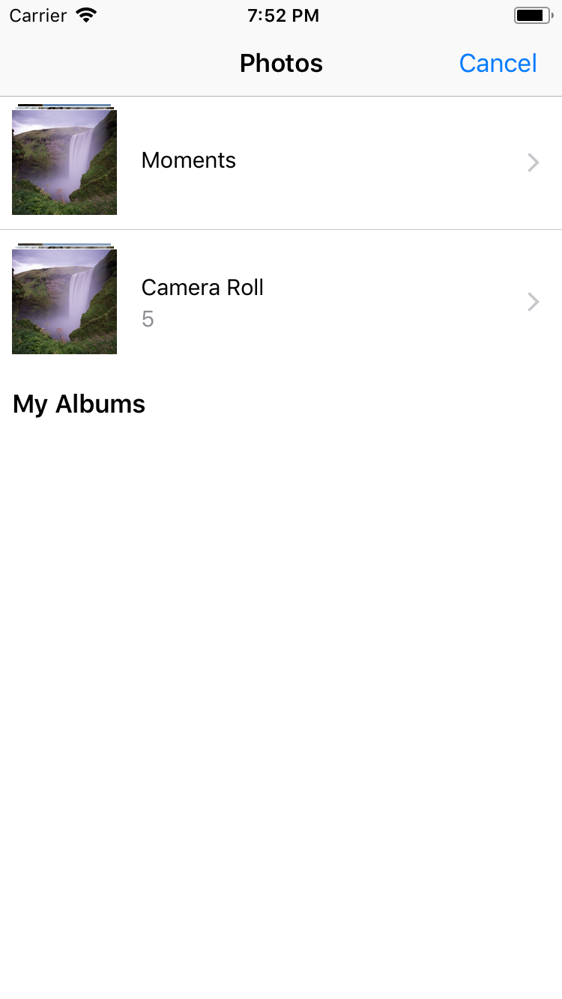
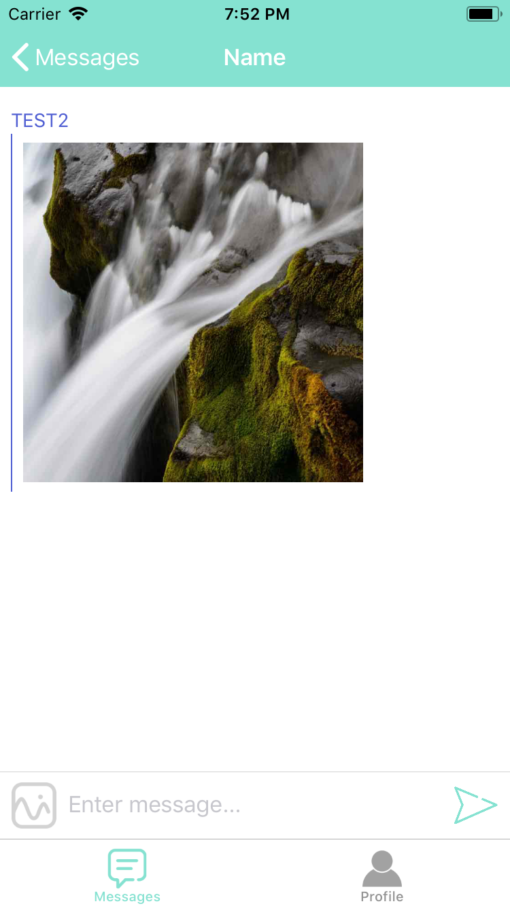
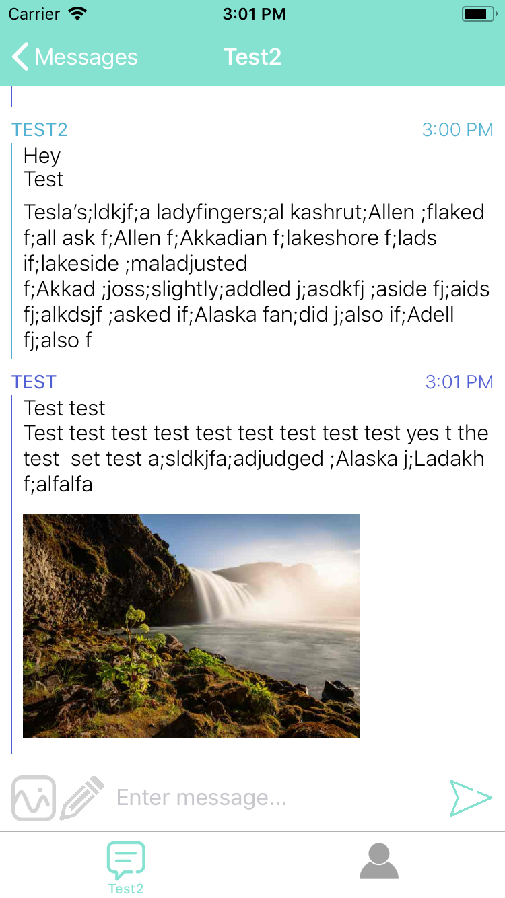

# Summer
### Messaging App
Winter Break Project
 - Google Firebase Database/Storage/Auth

### W.I.P. Screenshots
##### Login/Register Pages:
   
 
##### Messages/Users Lists (Old UI), Profile Page:
   
 
##### Chat Page, Sending Text / Photos:
    
 
##### Updated UI / added Drawing Functionality:
    
 
   

