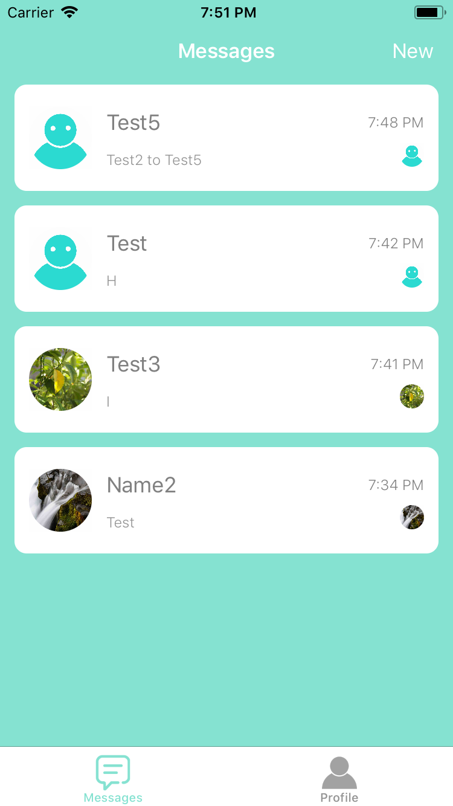
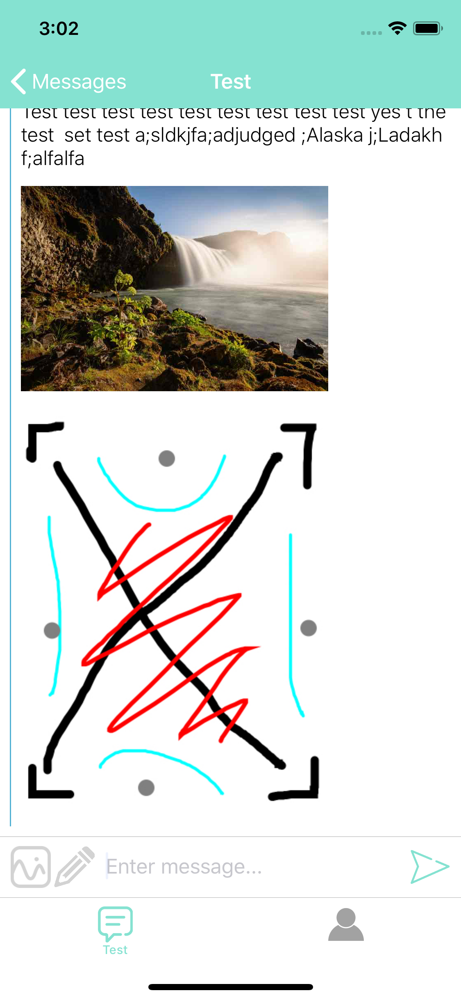
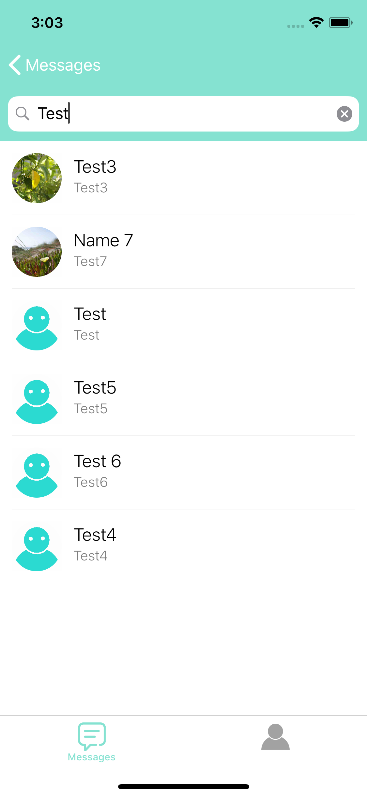

# Summer
### Messaging App

Summer is a real-time messaging app created with Google Firebase. Users can register an account with their name, username, email, and password. The profile picture can be changed in registration by clicking on the profile icon and selecting an image from the camera roll. Once logged in, users can view and send messages to others, by selecting on a message in the home messages screen, or by tapping on the "New" button, allowing the user to start a conversation. Users can also send/receive images and drawings.

### Screenshots
##### Login/Register/Messages/Chat/Users/Profile Pages:
       
 
##### Sending Texts/Photos/Drawings:
     

##### Updated UI for Messages/Users Lists:
   
